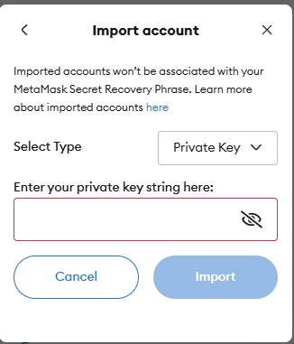
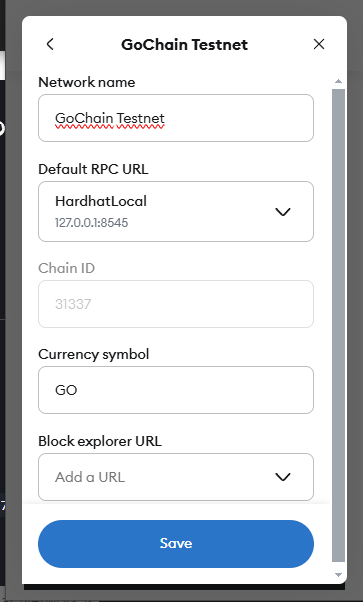

# InsureChain

This sample project allows users to submit insurance claims, view claim statuses, and for admin (contract owner address) to update claim statuses. The project also integrates IPFS for document storage.
It uses typescript on frontend and backend to keep it simple, Solidity for the smart contract.

## Prerequisites

- [Node.js (v14 or later)](https://nodejs.org/)
- [npm (v6 or later)](https://www.npmjs.com/get-npm)
- [MetaMask extension](https://metamask.io/download.html) installed in your browser

## Local Setup

### Clone the Repository

```bash
git clone https://github.com/DarrielKremov/insurance-chain.git
cd insurance-chain
```

### Install Dependencies

#### Smart Contract
```bash
cd smart-contract
npm install
```

#### Backend
```bash
cd ../backend
npm install
```

#### Frontend
```bash
cd ../frontend
npm install
```

### Start Local Hardhat Node &  Deploy Smart Contract
```bash
cd ../smart-contract
npx hardhat node
```
Once you start the node, you should see a list of private keys and addresses that are predefined for the network. Copy the first address.

Edit the `parameters.json` file in `smart-contract/ignition` - the `owner` field needs to be the address of the first account, the Hardhat Network uses that by default. You can alternatively play around with the config.

After that you can proceed with the deployment:
```bash
npx hardhat ignition deploy ignition/modules/InsuranceClaims.ts --parameters ignition/parameters.json --network localhost
```

### Setup MetaMask
If you don't already have MetaMask installed, you can get it from https://metamask.io/download/

- From the accounts dropdown of the extension use the `Add account or hardware wallet` button
  <br/><br/>
  
- Then click  `Import account`:
  <br/><br/>
  
- Enter the private key for the first address from the Hardhat Network (the address you used as `owner`). You should now have access to the account.
- Connect to your local network - you might see the option automatically as `Localhost 8545`, but you should double-check the settings by clicking the three dots button on the right side and `Edit` to view the settings. `Chain ID` MUST be `31337` and the `Default RPC URL` should be either `localhost:8545` or `127.0.0.1:8545`. If it is not, you should add a custom network instead. It should look like this:
  <br/><br/>


### Update backend `.env` file
Create or update the `.env` file in the `backend` directory with the necessary environment variables. It should be like this, just replace with the address of the deployed contract - the Ignition deployment should print it out in the terminal.
```bash
# Backend Configuration
PORT=3001
CONTRACT_ADDRESS=your_deployed_contract_address_here
PROVIDER_URL=http://127.0.0.1:8545
```

### Start backend & frontend
Finally we can launch the apps as well. You will need multiple terminals or run in the background. Keeping it short here with the basic approach with multiple terminals:
```bash
cd backend
npm run dev
```
```bash
cd frontend
npm start
```

The frontend should launch automatically or you can navigate to it at ```http://localhost:3000```

Connect with your new MetaMask address and play around!
